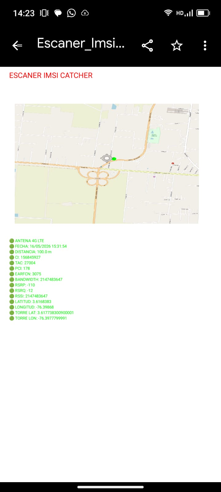

<h1 style="font-size: 3em; color: #FF0000;">•  DETECTOR DE IMSI CATCHER </h1> 

Este proyecto integra un mapa con ubicacion exacta en GPS y ubicacion probable de la antena mas cercana de celular 4G, el software primero pide permisos para usar el GPS y el 4G del celular, luego lo ubica en el mapa y calculando el RSSI muestra la ubicacion probable de la antena, todos estos datos son legales de sensar, pero cuando la antena baja a 2G que puede darse por mas de 1000 dispositivos conectados o tambien puede darse porque un IMSI CATCHER va a empezar a roba informacion, por lo anterior este software indica en color rojo cuando la antena esta en 2G, y tambien tiene la opcion de exportar en PDF todos los datos indicados de esta antena espia.

Los datos que grafica el software sobre cada antena son los siguientes.
ANTENA
DISTANCIA
CI 
TAC
PCI
EARFCN
BANDWIDTH
RSRP
RSRQ
RSSI
ASU

<h2> ¡¡ ADVERTENCIA !! , TODOS LOS SOFTWARE DE ESTE REPOSITORIO, RELACIONADOS A CIBERSEGURIDAD TIENEN FUNCIONES EDUCATIVAS Y PEDAGOGICAS, NO DEBEN USARSE PARA VIOLAR PRIVACIDADES, NO DEBE USARSE SIN CONSENTIMIENTO DEL PROPIETARIO DEL DISPOSITIVO A HACKEAR. SON PROGRAMAS DE HACKING ETICO Y LA PERSONA QUE ACCEDAN A ESTOS SOFTWARE SON RESPONSABLE DE SU USO.</h2> 

