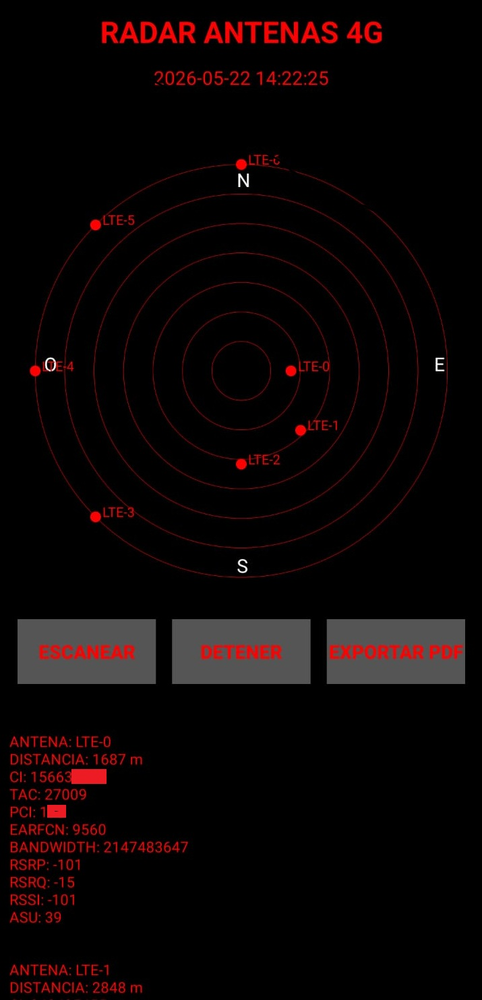

<h1 style="font-size: 3em; color: #FF0000;">•  RADAR TORRES DE CELULAR 4G CON EVIDENCIA </h1> 

Este proyecto consiste en un radar que indique la ubicacion probable de las torres de comunicacion 4g cercanas a donde esta el celular. Inicialmente el APK pide permisos para usar el GPS y la antena 4G, luego se abre la aplicacion y muestra un radar con la mayor cantidad de informacion que se puede obtener legalmente de las antenas, tambien muestra en pantalla la ubicacion exacta del GPS y la fecha y hora actual, por ultimo el boton de PDF puede descargar todos estos datos en un archivo PDF.

Los datos que grafica el software sobre cada antena son los siguientes.
ANTENA
DISTANCIA
CI 
TAC
PCI
EARFCN
BANDWIDTH
RSRP
RSRQ
RSSI
ASU

<h2> ¡¡ ADVERTENCIA !! , TODOS LOS SOFTWARE DE ESTE REPOSITORIO, RELACIONADOS A CIBERSEGURIDAD TIENEN FUNCIONES EDUCATIVAS Y PEDAGOGICAS, NO DEBEN USARSE PARA VIOLAR PRIVACIDADES, NO DEBE USARSE SIN CONSENTIMIENTO DEL PROPIETARIO DEL DISPOSITIVO A HACKEAR. SON PROGRAMAS DE HACKING ETICO Y LA PERSONA QUE ACCEDAN A ESTOS SOFTWARE SON RESPONSABLE DE SU USO.</h2> 

